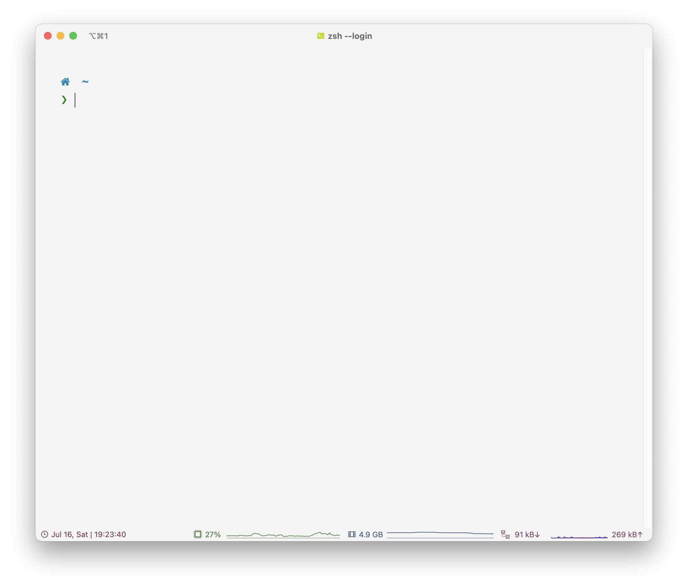
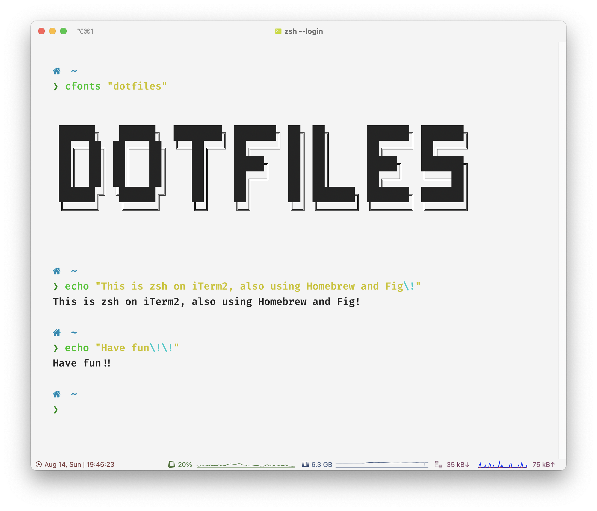
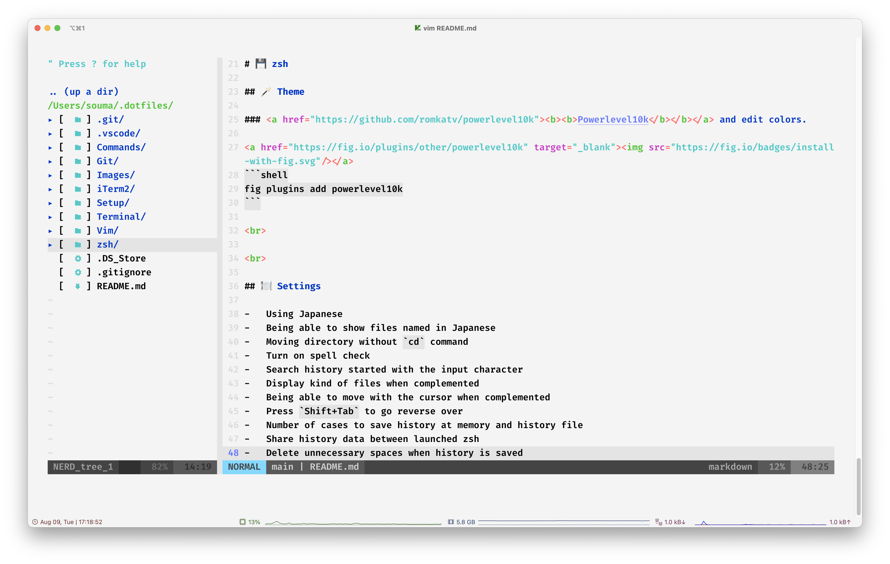
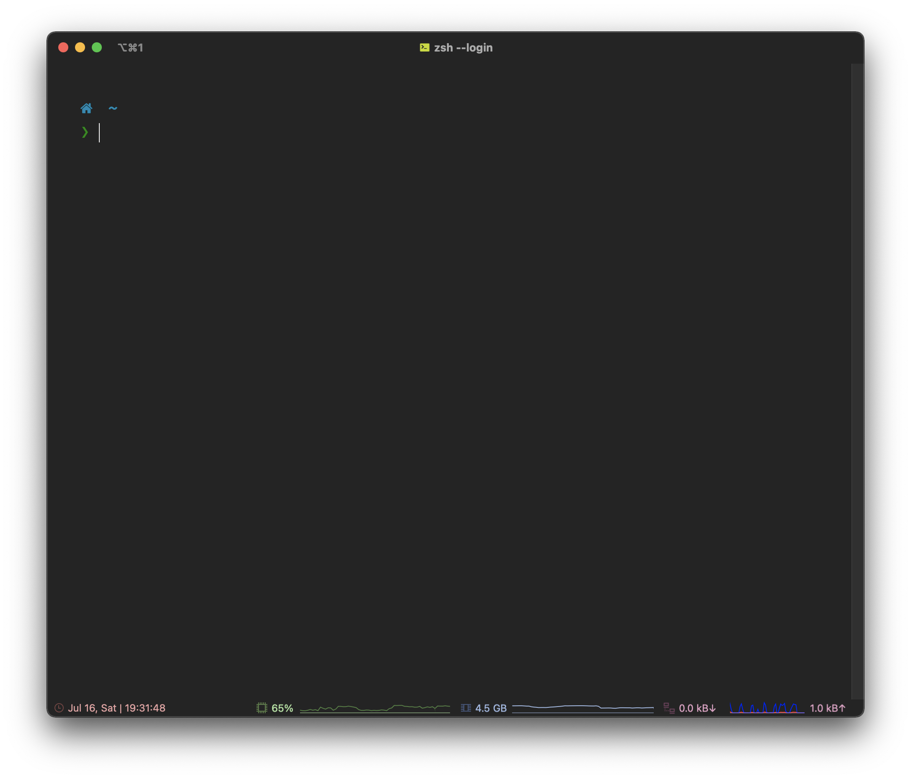
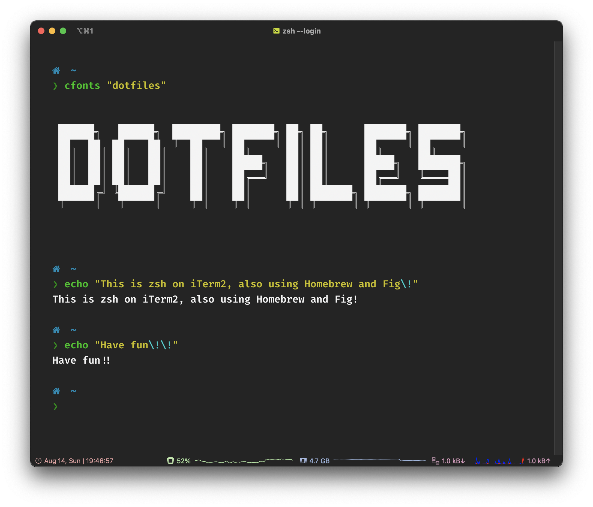
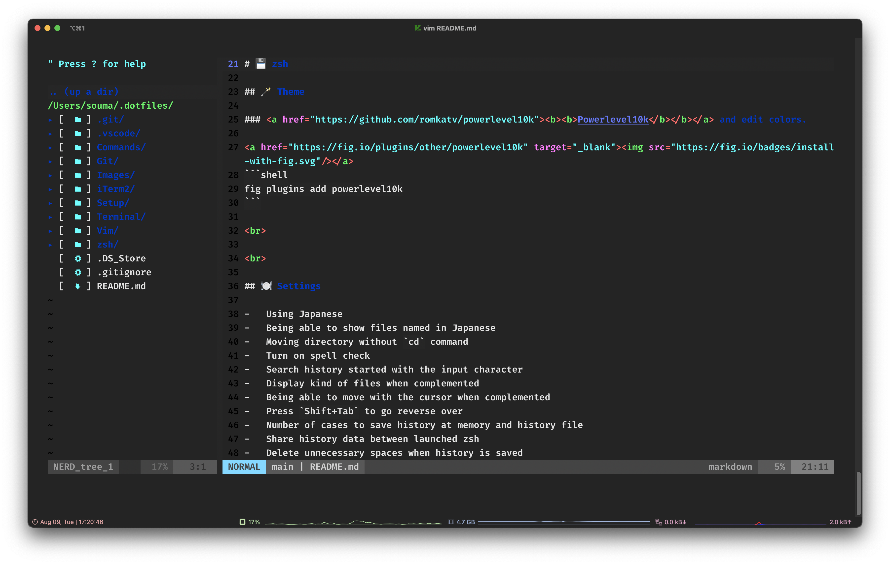

<br>

<div align="center">
    
    
    <b><p>The most minimal and useful dotfiles ever.</p></b>
    <p>My zsh, vim and other settings, plugins, etc and setup.</p>
</div>

<br><br>

## 🔐 Requirements

- **macOS** Big Sur `Version 11` or later
- Intel or Apple Silicon Mac

<br><br>

## 📲 Installation

Run [setup script](https://github.com/5ouma/dotfiles/blob/HEAD/setup) with `curl`, then you will be able to set up by operation.

```shell
/bin/zsh -c "$(curl -fsSL https://souma.vercel.app/dotfiles)"
```

<br>

## 📊 Usage

### `setup --help`

```
USAGE:
    setup

OPTIONS:
    -h, --help    Print help information
    -y, --yes     Run all configuration
    -s, --set     Set files to home directory

COMMANDS:
    install <languages>      Install programming languages with asdf
    uninstall <languages>    Uninstall programming languages from asdf
```

<br><br>

## 🌄 Screenshots

|            |                             Overview                              |                       Interacting with zsh                        | Vim with [NERDTree](https://github.com/preservim/nerdtree)        |
| :--------: | :---------------------------------------------------------------: | :---------------------------------------------------------------: | ----------------------------------------------------------------- |
| Light Mode |  |  |  |
| Dark Mode  |    |    |    |

<br><br>

## 🎨 ANSI Colors

|   \     |                                 Normal                                 |                                 Bright                                 |
| :-----: | :--------------------------------------------------------------------: | :--------------------------------------------------------------------: |
|  Black  |  `#000000` |  `#686868` |
|   Red   |  `#C51E14` |  `#FD6F6B` |
|  Green  |  `#1DC121` |  `#67F86F` |
| Yellow  |  `#C7C329` |  `#FFFA72` |
|  Blue   |  `#0A2FC4` |  `#6A76FB` |
| Magenta |  `#C839C5` |  `#FD7CFC` |
|  Cyan   |  `#20C5C6` |  `#68FDFE` |
|  White  |  `#C7C7C7` |  `#FFFFFF` |

<br><br>

## 💾 zsh

### 🪄 Theme

#### <a href="https://github.com/romkatv/powerlevel10k"><b><b>Powerlevel10k</b></b></a> and edit colors.

<a href="https://fig.io/plugins/other/powerlevel10k" target="_blank"></a>

```shell
fig plugins add powerlevel10k
```

<br>

### 🍽 Settings

- Using Japanese.
- Being able to show files named in Japanese.
- Moving directory without `cd` command.
- Turn on spell check.
- Search history started with the input character.
- Display the type of files when completed.
- Being able to move with the cursor when completed.
- Press `Shift+Tab` to go reverse over.
- The number of cases to save history at memory and history file.
- Share history data between launched zsh.
- Delete unnecessary spaces when history is saved.
- If input commands have already been saved in history, delete them from the older ones.
- Being able to do command line stacking.

To separate by rolls with .zshenv, .zprofile and .zshrc, seeing [this site](https://kitakitabauer.hatenablog.com/entry/2016/09/13/173456).

<br>

### 📥 Plugins

#### <a href="https://fig.io"><b>Fig</b></a>

([Fig on GitHub](https://github.com/withfig))

```shell
brew install fig
```

- #### <a href="https://github.com/zsh-users/zsh-syntax-highlighting"><b>zsh-syntax-highlighting</b></b></a>

  <a href="https://fig.io/plugins/color/zsh-syntax-highlighting" target="_blank"></a>

  ```shell
  fig plugins add zsh-syntax-highlighting
  ```

- #### <a href="https://github.com/zsh-users/zsh-autosuggestions"><b>zsh-autosuggestions</b></a>

  <a href="https://fig.io/plugins/completion/zsh-autosuggestions" target="_blank"></a>

  ```shell
  fig plugins add zsh-autosuggestions
  ```

- #### <a href="https://github.com/zsh-users/zsh-completions"><b>zsh-completions</b></a>

  ( To erase "insecure directories" error, see [this](https://qiita.com/riku929hr/items/d2a15276e94bd2b11e75). )

  <a href="https://fig.io/plugins/completion/zsh-completions" target="_blank"></a>

  ```shell
  fig plugins add zsh-completions
  ```

- #### <a href="https://github.com/hlissner/zsh-autopair"><b>zsh-autopair</b></a>

  <a href="https://fig.io/plugins/other/zsh-autopair_hlissner" target="_blank"></a>

  ```shell
  fig plugins add zsh-autopair_hlissner
  ```

- #### <a href="https://github.com/MichaelAquilina/zsh-you-should-use"><b>You Should Use</b></a>

  <a href="https://app.fig.io/plugins/zsh-you-should-use_MichaelAquilina" target="_blank"></a>

  ```shell
  fig plugins add zsh-you-should-use_MichaelAquilina
  ```

- #### <a href="https://github.com/sharkdp/bat"><b>bat</b></a>

  ```shell
  brew install bat
  ```

- #### <a href="https://github.com/Canop/broot"><b>Broot</b></a>

  ```shell
  brew install broot
  ```

- #### <a href="https://github.com/dominikwilkowski/cfonts"><b>CFONTS</b></a>

  ```shell
  brew install cfonts
  ```

- #### <a href="https://github.com/sindresorhus/dark-mode"><b>dark-mode</b></a>

  ```shell
  brew install dark-mode
  ```

- #### <a href="https://github.com/junegunn/fzf"><b>fzf</b></a>

  ```shell
  brew install fzf
  ```

- #### <a href="https://github.com/svenstaro/genact"><b>genact</b></a>

  ```shell
  brew install genact
  ```

- #### <a href="https://github.com/charmbracelet/glow"><b>glow</b></a>

  ```shell
  brew install glow
  ```

- #### <a href="https://github.com/sharkdp/hyperfine"><b>hyperfine</b></a>

  ```shell
  brew install hyperfine
  ```

- #### <a href="https://github.com/Ryu0118/Kusa"><b>Kusa</b></a>

  ```shell
  brew install Ryu0118/Kusa/kusa
  ```

- #### <a href="https://github.com/Peltoche/lsd"><b>lsd</b></a>

  ```shell
  brew install lsd
  ```

- #### <a href="https://github.com/rgcr/m-cli"><b>m-cli</b></a>

  ```shell
  brew install m-cli
  ```

- #### <a href="https://github.com/dylanaraps/neofetch"><b>neofetch</b></a>

  ```shell
  brew install neofetch
  ```

- #### <a href="https://github.com/sharkdp/pastel"><b>pastel</b></a>

  ```shell
  brew install pastel
  ```

- #### <a href="https://github.com/Aloxaf/silicon"><b>Silicon</b></a>

  ```shell
  brew install silicon
  ```

- #### <a href="https://github.com/XAMPPRocky/tokei"><b>tokei</b></a>

  ```shell
  brew install tokei
  ```

- #### <a href="https://github.com/ali-rantakari/trash"><b>trash</b></a>

  ```shell
  brew install trash
  ```

<br><br>

## 📝 Vim

### 🪄 Color Scheme

#### <a href="https://github.com/preservim/vim-colors-pencil"><b>vim-colors-pencil</b></a> and edit colors.

<br>

### 🍽 Settings

#### General

- Set the place of .vimrc and .viminfo.
- Set the text code to UTF-8.
- Not to create backup and swap files.
- Auto reloads file editing when it's changed.
- Being able to open the file even buffer is editing.
- Show typing command to status.
- Turn off the beep sound.
- Unlimited undo.
- Share clipboard with OS.
- Click to move the cursor.

#### Appearance

- Show line number.
- Highlight the cursor line.
- Being able to move one more character after the end of lines.
- Change indent as smart indent.
- Highlight corresponding brackets.
- Always show the status line.
- Complement on the command line.
- Being able to move by showed line when the lines are folded.
- Turn on syntax highlight.

#### Tabs

- Visible the invisible words.
- Change the tab to spaces.
- Set the tab to double-space.

#### Search

- If the searched sentences are lower case, search across all words.
- If it is contained in upper case, search only that ones.
- Hit when typing searching sentences.
- Go to the beginning word when searching for its end.
- Highlight searched words.
- Endhighlight by typing the ESC key several times.

<br>

### 📥 Plugins

vim-jetpack, a plugin manager, is already installed in .vim/autoload, so you don't need to install it.
But you have to run this command on vim screen.

```vim
Jetpack
```

#### <a href="https://github.com/tani/vim-jetpack"><b>vim-jetpack</b></a>

```shell
curl -fLo ~/.vim/autoload/jetpack.vim --create-dirs https://raw.githubusercontent.com/tani/vim-jetpack/master/autoload/jetpack.vim
```

- #### <a href="https://github.com/airblade/vim-gitgutter"><b>vim-gitgutter</b></a>

  Add `Jetpack 'airblade/vim-gitgutter'` to your .vimrc file..

- #### <a href="https://github.com/bronson/vim-trailing-whitespace"><b>vim-trailing-whitespace</b></a>

  Add `Jetpack 'bronson/vim-trailing-whitespace'` to your .vimrc file..

- #### <a href="https://github.com/cohama/lexima.vim"><b>lexima.vim</b></a>

  Add `Jetpack 'cohama/lexima.vim'` to your .vimrc file..

- #### <a href="https://github.com/itchyny/lightline.vim"><b>lightline.vim</b></a>

  Add `Jetpack 'itchyny/lightline.vim'` to your .vimrc file..

- #### <a href="https://github.com/mbbill/undotree"><b>Undotree</b></a>

  Add `Jetpack 'mbbill/undotree'` to your .vimrc file..

- #### <a href="https://github.com/matze/vim-move"><b>move</b></a>

  Add `Jetpack 'matze/vim-move'` to your .vimrc file.

- #### <a href="https://github.com/preservim/nerdtree"><b>The NERDTree</b></a>

  Add `Jetpack 'preservim/nerdtree'` to your .vimrc file.

- #### <a href="https://github.com/ryanoasis/vim-devicons"><b>vim-devicons</b></a>

  Add `Jetpack 'ryanoasis/vim-devicons'` to your .vimrc file.

- #### <a href="https://github.com/tpope/vim-commentary"><b>vim-commentary.vim</b></a>

  Add `Jetpack 'tpope/vim-commentary'` to your .vimrc file.

- #### <a href="https://github.com/tpope/vim-surround"><b>vim-surround</b></a>

  Add `Jetpack 'tpope/vim-surround'` to your .vimrc file.

- #### <a href="https://github.com/vim-scripts/vim-auto-save"><b>AutoSave</b></a>

  Add `Jetpack 'vim-scripts/vim-auto-save'` to your .vimrc file.

- #### <a href="https://github.com/Xuyuanp/nerdtree-git-plugin"><b>NERDTree-git-plugin</b></a>

  Add `Jetpack 'Xuyuanp/nerdtree-git-plugin'` to your .vimrc file.

<br><br>

## 🐙 Git

### 🍽 Settings

- Ignore `.DS_Store` files by adding to `~/.config/git/ignore`.
- The alias to commit temporary with Vim.

<br>

### 📥 Plugins

- #### <a href="https://github.com/wfxr/forgit"><b>forgit</b></a>

  <a href="https://fig.io/plugins/other/forgit" target="_blank"></a>

  ```shell
  fig plugins add forgit
  ```

- #### <a href="https://github.com/paulirish/git-open"><b>git-open</b></a>

  ```shell
  brew install git-open
  ```

- #### <a href="https://github.com/extrawurst/gitui"><b>GitUI</b></a>

  ```shell
  brew install gitui
  ```

- #### <a href="https://github.com/x-motemen/ghq"><b>ghq</b></a>

  ```shell
  brew install ghq
  ```

- #### <a href="https://github.com/o2sh/onefetch"><b>onefetch</b></a>

  ```shell
  brew install onefetch
  ```

- #### <a href="https://github.com/Bhupesh-V/ugit"><b>ugit</b></a>

  ```shell
  brew install ugit
  ```

<br><br>

## 🍺 Homebrew

### 🍽 Settings

- Make Brewfile and move to dotfiles directory when running install, uninstall, tap and untap correctly.
- Automatically uninstall unused dependency formulae.

<br>

### 📥 Plugins

- #### <a href="https://github.com/Homebrew/homebrew-autoupdate"><b>Homebrew Autoupdate</b></a>

  ```shell
  brew tap homebrew/autoupdate
  brew autoupdate start
  ```
