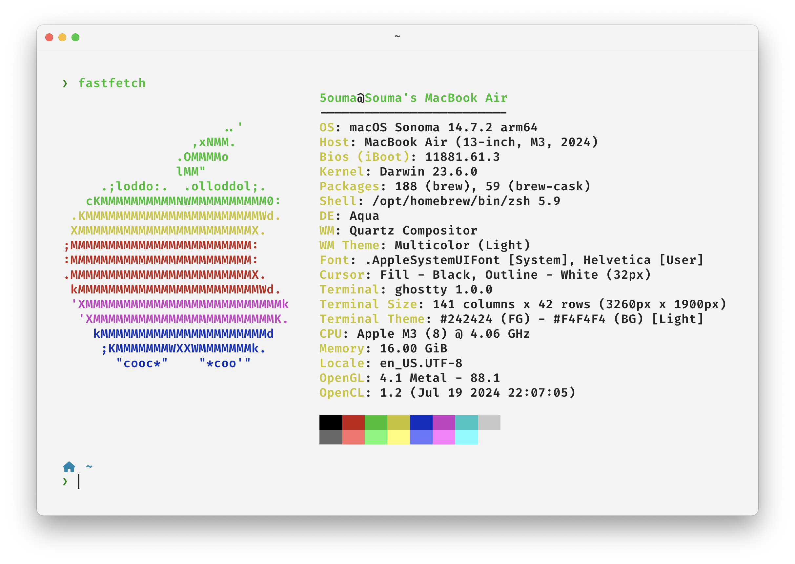
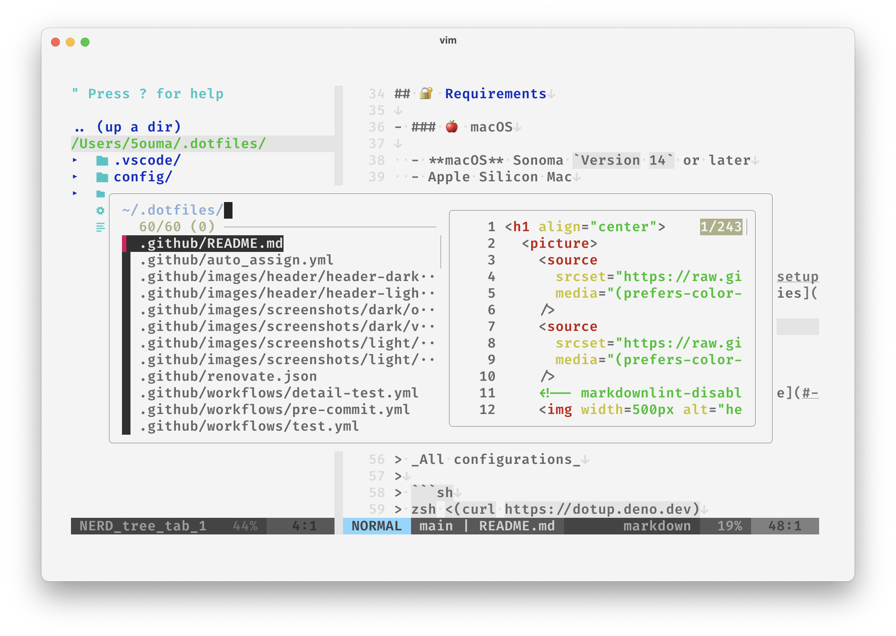
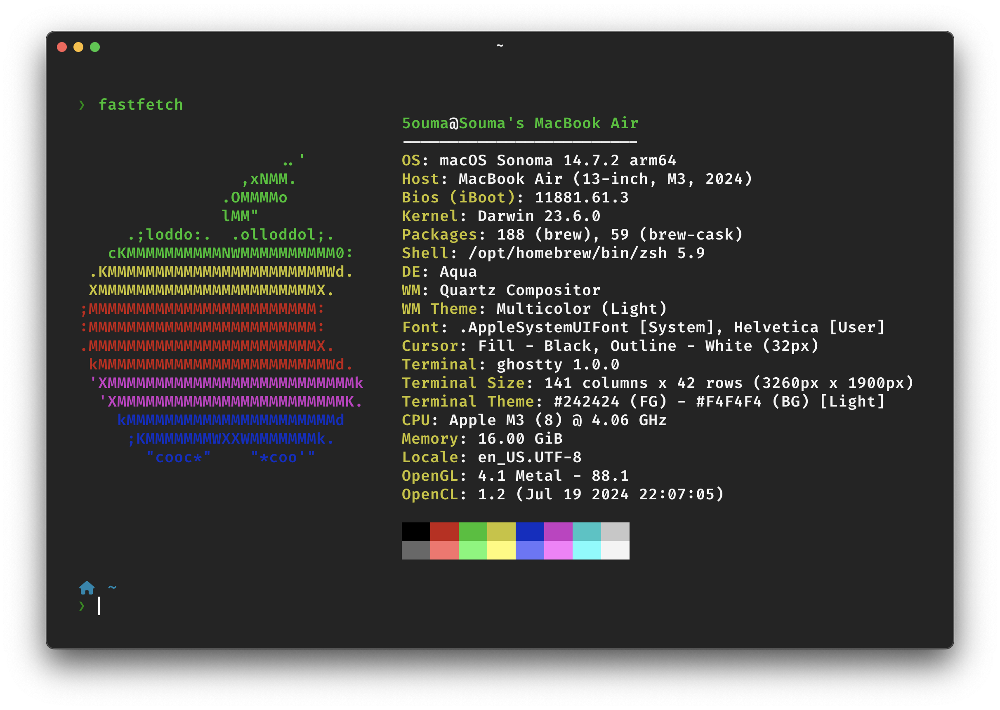
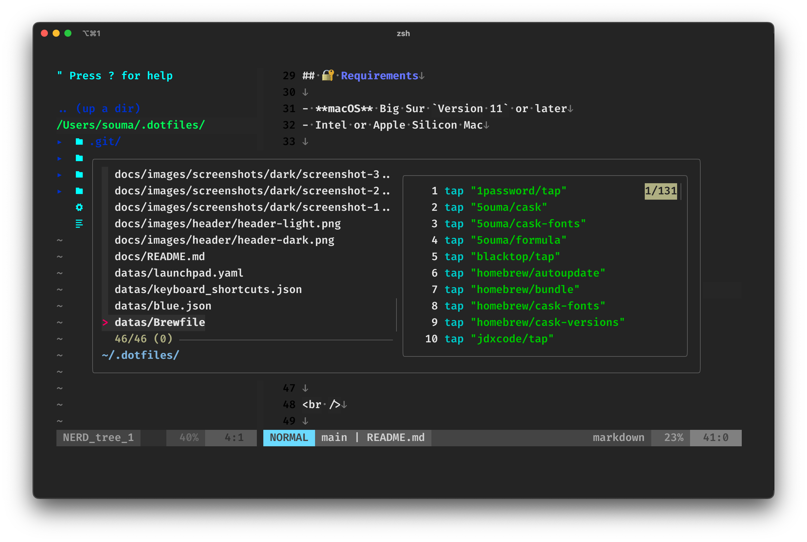

<br />

<div align="center">

  <picture>
    <source
      srcset="https://raw.githubusercontent.com/5ouma/dotfiles/main/docs/images/header/header-light.png"
      media="(prefers-color-scheme: light)"
    />
    <source
      srcset="https://raw.githubusercontent.com/5ouma/dotfiles/main/docs/images/header/header-dark.png"
      media="(prefers-color-scheme: dark)"
    />
    
  </picture>

**⚙ The most minimal and powerful dotfiles ever.** <br />
My config files and setup for CLI tools and GUI apps.


</div>

<br /><br />

## 🔐 Requirements

- **macOS** Big Sur `Version 11` or later
- Intel or Apple Silicon Mac

<br /><br />

## 📥 Installation

Run one line [setup](../setup), see the [usage](#-usage).

<br />

> _All configurations_
>
> ```shell
> zsh <(curl -sL dotup.vercel.app)
> ```

<br />

> _Just config files_
>
> ```shell
> zsh <(curl -sL dotup.vercel.app) -s
> ```

<br /><br />

## 📊 Usage

### `setup --help`

```
Usage: setup

⚙️ The most minimal and powerful dotfiles ever.

Flags:
  -h, --help    Print help information
  -y, --yes     Start without confirmation
  -s, --set     Set files to home directory
```

<br /><br />

## 🌄 Screenshots

|            |                           Overview                           |                        Vim                         |
| :--------: | :----------------------------------------------------------: | :------------------------------------------------: |
| Light Mode |  |  |
| Dark Mode  |    |    |
|   Tools    |                      [fastfetch], [Fig]                      |       [lightline.vim], [NERDTree], [fzf.vim]       |

[fastfetch]: https://github.com/fastfetch-cli/fastfetch
[Fig]: https://fig.io
[lightline.vim]: https://github.com/itchyny/lightline.vim
[NERDTree]: https://github.com/preservim/nerdtree
[fzf.vim]: https://github.com/junegunn/fzf.vim

<br /><br />

## 📝 Details

- ### Package Manager : [🍺 `Homebrew`](https://brew.sh)

  ```shell
  /bin/bash -c "$(curl -fsSL https://raw.githubusercontent.com/Homebrew/install/HEAD/install.sh)"
  ```

  > See packages in **[`Brewfile`](../datas/Brewfile)** or on **[`Shell Commands`](https://github.com/stars/5ouma/lists/shell-commands)**, **[`Softwares`](https://github.com/stars/5ouma/lists/softwares)** _(GitHub Star List)_

<br />

- ### Runtime Manager : [📼 `rtx`](https://github.com/jdxcode/rtx)

  ```shell
  brew install jdxcode/tap/rtx
  ```

<br />

- ### Terminal : [📺 `iTerm2`](https://iterm2.com)

  ```shell
  brew install iterm2-beta
  ```

  - #### Font 1 : [🖋 `Fira Code`](https://github.com/tonsky/FiraCode)

    ```shell
    brew install font-firacode
    ```

  - #### Font 2 : [✒️ `HackGen35`](https://github.com/yuru7/hackgen)

    ```shell
    brew install font-hackgen font-hackgen-nerd
    ```

<br />

- ### Shell : [🐚 `Zsh`](https://zsh.org)

  - #### Plugin Manager : [🔌 `Sheldon`](https://github.com/rossmacarthur/sheldon)

    ```shell
    brew install sheldon
    ```

    > See plugins in **[`plugins.toml`](../packages/sheldon/.config/sheldon/plugins.toml)** or on **[`Zsh Plugins`](https://github.com/stars/5ouma/lists/zsh-plugins)** _(GitHub Star List)_

  - #### Theme : [❯ `Powerlevel10k`](https://github.com/romkatv/powerlevel10k)

    ```shell
    sheldon add powerlevel10k --github romkatv/powerlevel10k --apply source
    ```

  - #### Terminal Autocompletion : [◧ `Fig`](https://fig.io)

    ```shell
    brew install fig
    ```

<br />

- ### Terminal Editor : 🖌 `Vim`

  - #### Plugin Manager : [🚀 `Jetpack`](https://github.com/5ouma/vim-jetpack)

    ```shell
    curl -fLo "${XDG_DATA_HOME:-$HOME/.local/share}/vim/pack/jetpack/opt/vim-jetpack/plugin/jetpack.vim" --create-dirs https://raw.githubusercontent.com/5ouma/vim-jetpack/master/plugin/jetpack.vim
    ```

    > See plugins in **[`plugins.vim`](../packages/vim/.config/vim/plugins.vim)** or on **[`Vim Plugins`](https://github.com/stars/5ouma/lists/vim-plugins)** _(GitHub Star List)_

  - #### Color Scheme : [✏️ `Pencil`](https://github.com/5ouma/vim-colors-pencil)

  - #### LSP: [💾 `vim-lsp`](https://github.com/prabirshrestha/vim-lsp)

<br /><br />

## 🎨 ANSI Colors

|   \     |                                 Normal                                 |                                 Bright                                 |
| :-----: | :--------------------------------------------------------------------: | :--------------------------------------------------------------------: |
|  Black  |  `#000000` |  `#686868` |
|   Red   |  `#C51E14` |  `#FD6F6B` |
|  Green  |  `#1DC121` |  `#67F86F` |
| Yellow  |  `#C7C329` |  `#FFFA72` |
|  Blue   |  `#0A2FC4` |  `#6A76FB` |
| Magenta |  `#C839C5` |  `#FD7CFC` |
|  Cyan   |  `#20C5C6` |  `#68FDFE` |
|  White  |  `#C7C7C7` |  `#FFFFFF` |
